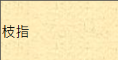
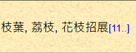
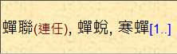
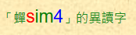
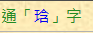
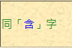
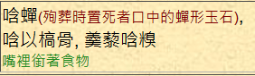
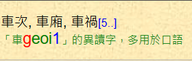

# lexi-can-crawler

Crawler for Cantonese pronunciation data on Research Institute for the Humanities, Faculty of Arts, The Chinese University of Hong Kong ([粵語審音配詞字庫](http://humanum.arts.cuhk.edu.hk/Lexis/lexi-can/))

## Result

See [releases page](https://github.com/sgalal/lexi_can_crawler/releases).

Sample data:

```json
[
  {
    "ch": "一",
    "initial": "j",
    "rhyme": "at",
    "tone": "1",
    "words": [ "一致", "統一", "一枝獨秀", "一般", "一切", "一樣", "專一", "劃一", "一視同仁", "一觸即發", "一落千丈", "長短不一" ]
  },
  {
    "ch": "丈",
    "initial": "z",
    "rhyme": "oeng",
    "tone": "6",
    "words": [ "丈夫", "丈人", "丈母", "清丈", "丈量", "岳丈", "一落千丈", "丈二金剛" ]
  },
  {
    "ch": "丙",
    "initial": "b",
    "rhyme": "ing",
    "tone": "2",
    "words": [ "丙等", "丙夜", "付丙", "丙吉問牛" ]
  }
]
```

## Design

**(1)** Get a list of **all Chinese characters** on that website from [classified character table](http://humanum.arts.cuhk.edu.hk/Lexis/lexi-can/classified.php?st=0)

**(2)** Get the result of **each character** by [Scrapy](https://scrapy.org/)

**Detailed explanation:**

**(1)** Get a list of all Chinese characters

Download the classified character table.

Decode as `big5hkscs`.

Iterate through the text with the regex `<a href="search.php\?q=([%0-9A-Za-z_]+)">(.)</a>` to extract the characters and their corresponding links.

**(2)** Get the result of each character

Nomenclature: page &gt; data row &gt; field

**2\.1** Get data rows in a single page

`form > table:first-child > tr:not(:first-child)`

**2\.2** Get fields in a single data row

* Initial: `td:nth-child(1) > font[color="red"]::text`
* Rhyme: `td:nth-child(1) > font[color="green"]::text`
* Tone: `td:nth-child(1) > font[color="blue"]::text`
* Words and explanation: `td:nth-child(6)`
    - Words: `div[nowrap]`, `div[id$="_detial"]`
    - Explanation: `font[color="forestgreen"]`

<p style="border: 1px solid black; border-radius: 0.25em; padding: 0 0.5em;"><b>Tips:</b> When encountering decoding problem, try decoding as `big5hkscs` instead of `big5`.</p>

## Run

```sh
$ python3 preprocessing.py
$ scrapy crawl lexi -s LOG_ENABLED=False -o data3.json
$ python3 postprocessing.py
```

## License

Code for building the data is distributed under MIT license.

Dictionary data follows the original license.

## Sample HTML

(0)



```html
<td>
    <div nowrap>枝指</div>
</td>
```

(1)



```html
<td>
    <div nowrap>
        枝葉, 荔枝, 花枝招展
        <a href="#1" onclick="xid_down('zi1_detial')">
            <font size="-1">[11..]</font>
        </a>
    </div>
    <div id="zi1_detial" style="display: none">
        枝幹, 枝椏, 樹枝, 折枝, 接枝, 比翼連枝, 同氣連枝, 金枝玉葉, 節外生枝, 細枝末節, 枝葉扶疏
    </div>
</td>
```

(2)



```html
<td>
    <div nowrap>
        蟬聯
        <font size="-1" color="maroon">(連任)</font>
        , 蟬蛻, 寒蟬
        <a href="#1" onclick="xid_down('sim4_detial')">
            <font size="-1">[1..]</font>
        </a>
    </div>
    <div id="sim4_detial" style="display: none">
        噤若寒蟬
    </div>
</td>
```

(3)



```html
<td>
    <div nowrap></div>
    <font size="-1" color="forestgreen">
        「蟬
        <font size="+1" color="red">s</font>
        <font size="+1" color="green">im</font>
        <font size="+1" color="blue">4</font>
        」的異讀字
    </font>
</td>
```

(4)



```html
<td>
    <div nowrap></div>
    <font size="-1" color="forestgreen">
        通「
        <a href="search.php?q=%D6r">琀</a>
        」字
    </font>
</td>
```

(5)



```html
<td>
    <div nowrap></div>
    <font size="-1" color="forestgreen">
        同「
        <a href="search.php?q=%A7t">含</a>
        」字
    </font>
</td>
```

(6)



```html
<td>
    <div nowrap>
        唅蟬
        <font size="-1" color="maroon">(殉葬時置死者口中的蟬形玉石)</font>
        , 
        <br>
        唅以槁骨, 羹藜唅糗
    </div>
    <font size="-1" color="forestgreen">嘴裡銜著食物</font>
</td>
```

(7) 車、媽、唳、涌、牏



```html
<td>
    <div nowrap>
        車次, 車廂, 車禍
        <a href="#1" onclick="xid_down('ce1_detial')">
            <font size="-1">[5..]</font>
        </a>
    </div>
    <div id="ce1_detial" style="display: none">
        車裂, 車間, 車輛, 火車, 汽車
    </div>
    <font size="-1" color="forestgreen">
        「車
        <font size="+1" color="red">g</font>
        <font size="+1" color="green">eoi</font>
        <font size="+1" color="blue">1</font>
        」的異讀字，多用於口語
    </font>
</td>
```
